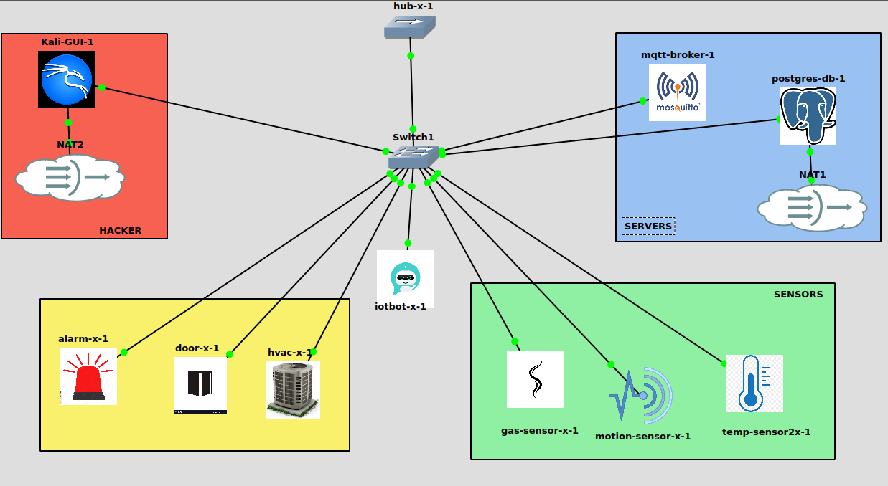

# IoTBot Security System (GNS3-Ready Cybersecurity Framework)

This is a complete and modular **IoT security testbed** built for educational and research purposes. The project simulates a smart building infrastructure and defends it against real-time cyberattacks using Python, MQTT, and PostgreSQL. It is fully integrated with **GNS3** for network emulation and supports dynamic reconfiguration using environment variables.

## Overview

The system consists of:

- MQTT broker with optional **TLS**, **authentication**, and **access control lists (ACLs)**
- Multiple sensor and actuator nodes (Temperature, Gas, Motion, HVAC, Door, Alarm)
- A central **Hub** that filters, logs, and routes device communications
- A real-time **IoTBot** that monitors traffic and mitigates attacks
- A **credential sniffer** to simulate Man-in-the-Middle attacks
- SQL Injection and DDoS **attack simulators** for offensive testing

All components support dynamic mode switching between:
- Open (no auth/TLS)
- Auth only
- TLS only
- Full security (TLS + Auth + ACL + HMAC)

These modes can be toggled using configuration files and environment variables.

## Architecture



This project was deployed entirely within GNS3 using Docker containers as nodes. Each device (sensor, hub, IoTBot, attacker) was manually instantiated and connected to a virtual switch.

```
[ Sensor Nodes ] ---> MQTT Broker ---> [ Hub ] ---> [ Actuators ]
                               |
                           [ IoTBot ]
                               |
                         [ PostgreSQL DB ]
```

Simulated via GNS3 for realistic network attack-defense scenarios.

## Security Features

| Feature             | Description                                                              |
|---------------------|--------------------------------------------------------------------------|
| TLS Encryption       | MQTT communication encrypted via CA-signed certificates                 |
| Username/Password    | Authentication based on Mosquitto password files                        |
| ACL Restrictions     | Topic-based permissions per device                                       |
| HMAC Verification    | Ensures message integrity between sensors, hub, and actuators           |
| Rate Limiting        | Detects per-device flooding (DoS attack mitigation)                     |
| Global Flood Detection| Monitors excessive message rate network-wide                          |
| SQL Injection Guard  | Filters malicious `device_id` inputs                                    |
| Unknown Device Quarantine | Prevents unauthorized communication or registration               |
| MITM Detection       | Simulated with `Sniffer.py` and blocked by TLS/HMAC                    |

## Components

| Type      | File                | Role                                                    |
|-----------|---------------------|----------------------------------------------------------|
| Hub       | `hub.py`            | Routes and controls actuators based on sensor data       |
| IoTBot    | `IoTBoT3.py`        | Monitors MQTT traffic, detects and mitigates attacks     |
| Sensors   | `stemp.py`, `sgas.py`, `smotion.py` | Simulate real-world data, publish to broker     |
| Actuators | `HVAC.py`, `Adoor.py`, `GasActuator.py` | Respond to filtered data from hub           |
| Sniffer   | `Sniffer.py`        | Simulates man-in-the-middle sniffing over MQTT port 1883 |
| SQLi Tool | `SQLinjection.py`   | Sends malicious payloads to test IoTBot defenses         |

## Broker Configuration Modes

You can dynamically select broker modes using one of these `.conf` files:

- `mosquitto_open.conf` — No security (testing only)
- `mosquitto_auth_only.conf` — Username/password + ACL
- `mosquitto_tls_only.conf` — TLS encryption, anonymous allowed
- `mosquitto_tls_auth.conf` — TLS + Auth + ACL (recommended)

## Environment Variable Support

Each device supports switching modes using:

```env
BROKER_ADDRESS=mqtt-broker
MQTT_USERNAME=user
MQTT_PASSWORD=pass
ENABLE_TLS=true
ENABLE_AUTH=true
ENABLE_HMAC=true
HMAC_SECRET=123iot45
```

Change values in `.env` files or compose overrides.

## Database Tables

| Table               | Purpose                              |
|---------------------|--------------------------------------|
| `sensor_data`       | Stores all validated sensor messages |
| `actuator_actions`  | Logs all actuator state changes      |
| `anomaly_logs`      | Captures anomalies (DDoS, SQLi, etc.)|
| `registered_devices`| Tracks known registered devices      |

## GNS3 Integration

This project was built and tested inside **GNS3** using Docker containers. Each node (sensor, hub, bot, etc.) is launched as a template container in a simulated network, making it ideal for demonstrating:

- Dynamic IP assignment
- MITM attacks via ARP spoofing
- Topology-based experimentation
- Real-time network security monitoring


## Future Enhancements

- Web dashboard for real-time monitoring
- Attack classification using ML
- Support for additional attack types (replay, fuzzing)
- Exportable PCAP logging for offline analysis

## Credits

Developed as part of a master-level **IoT Security course project**, simulating both attacker and defender roles in a real-world smart building.

## License

MIT License — free for research, education, and experimentation.
